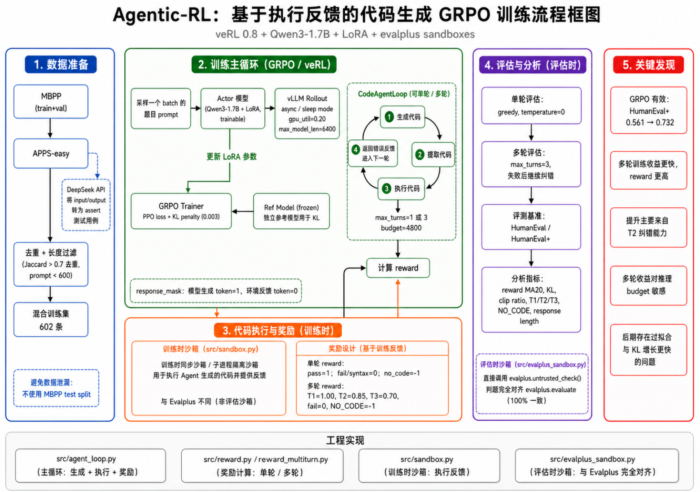
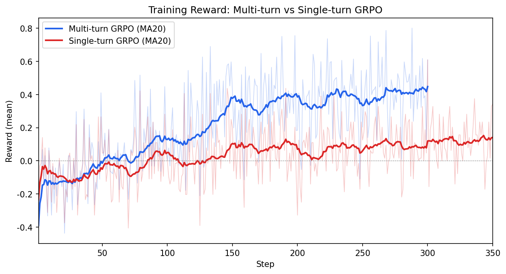
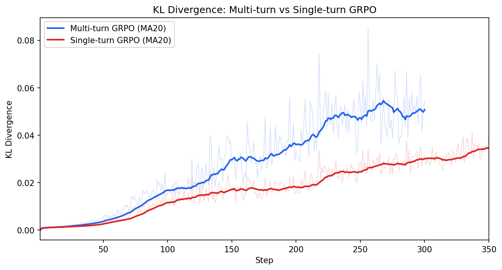
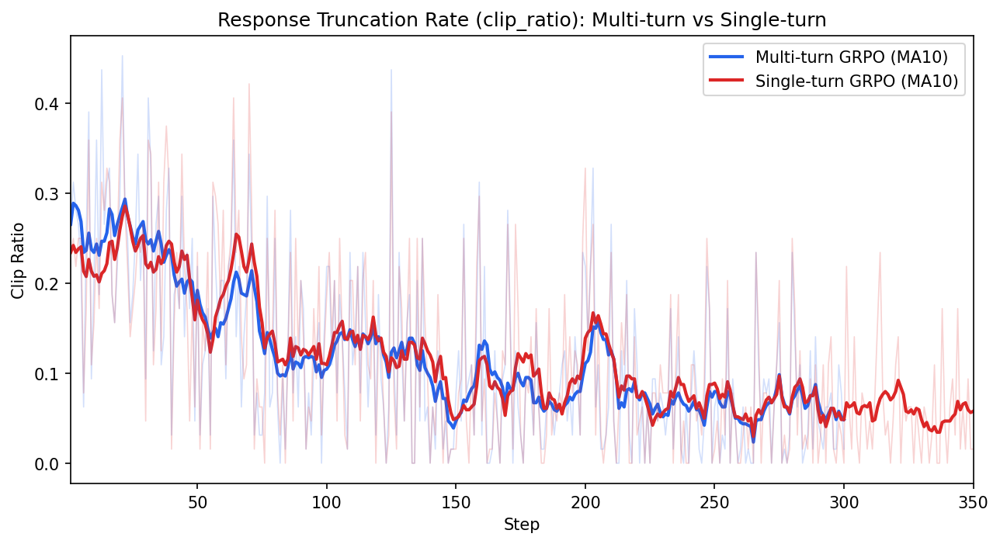
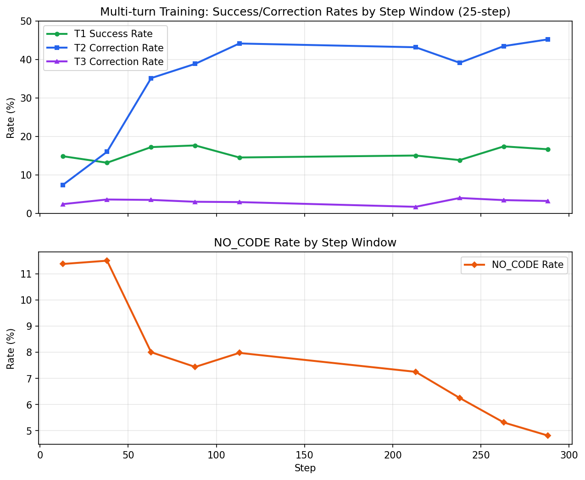
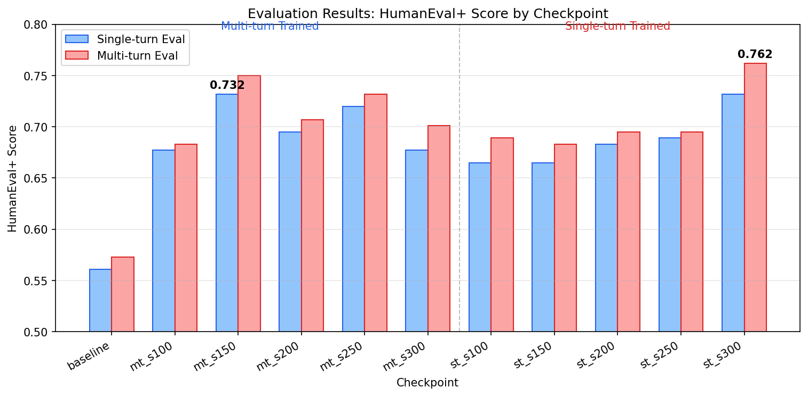
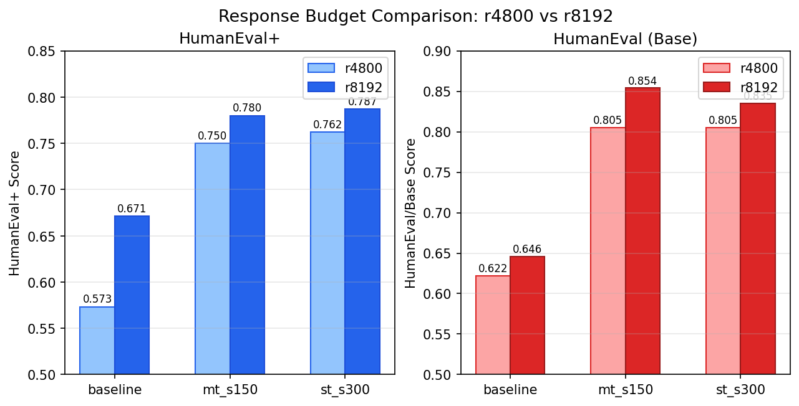
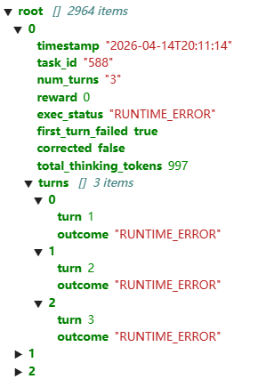

# Agentic-RL: 基于执行反馈的代码生成 GRPO 强化学习训练

> 使用 veRL 0.8 框架，对 Qwen3-1.7B 进行单轮/多轮 GRPO 训练，通过代码执行反馈实现自纠错能力的学习。

## 项目动机

大语言模型在代码生成任务中经常产生看似合理但实际有 bug 的代码。本项目探索一条路径：让模型在训练中**自动执行自己生成的代码**，根据执行结果获得 reward，通过 GRPO 强化学习逐步提升代码正确率，并进一步引入**多轮纠错机制**（AgentLoop），让模型学会根据错误反馈修正代码。

## 技术架构

### 训练框架



### 核心组件

| 组件 | 文件 | 功能 |
|------|------|------|
| 多轮 AgentLoop | `src/agent_loop.py` | 自定义 veRL AgentLoop，实现代码生成→执行→反馈→纠错的循环 |
| 单轮奖励函数 | `src/reward.py` | 代码执行 pass=+1, fail/syntax=0, no_code=-1 |
| 多轮奖励函数 | `src/reward_multiturn.py` | 稀疏奖励：T1通过=1.0, T2通过=0.85, T3通过=0.70, 失败=0, NO_CODE=-1 |
| evalplus 沙盒 | `src/evalplus_sandbox.py` | 直接调用 evalplus 的 `untrusted_check()`，100% 对齐 `evalplus.evaluate` 判卷 |
| 训练沙盒 | `src/sandbox.py` | 训练时用的同步沙盒（subprocess 隔离） |
| 数据准备 | `src/data_prepare.py` | MBPP(train+val) + APPS-easy 混合，去重后 602 条 |
| 测试用例生成 | `scripts/synth_testcases.py` | 用 LLM API（DeepSeek）将 APPS 的 input/output 对转为 assert 测试用例 |
| vLLM 补丁 | `scripts/patch_vllm.py` | 修复 LoRA 权重名、numpy int64、显存泄漏等 8 个问题 |

### 关键设计决策

1. **独立 Ref 模型解决 KL 失效**：FSDP + LoRA 下 `disable_adapter()` 无法工作（FSDP flatten 参数后隐藏 LoRA 层），强制使用独立 ref 模型计算 KL 散度，额外占用 ~3.4 GiB 显存
2. **evalplus 判卷对齐**：评估沙盒直接导入 evalplus 的 `untrusted_check()`，确保与 `python -m evalplus.evaluate` 100% 一致
3. **错误反馈脱敏**：traceback 中的 assert 行包含完整测试输入和期望输出，替换为 `assert <test_case>`，防止模型记忆测试用例
4. **response_mask 机制**：LLM 生成的 token mask=1（参与梯度），环境反馈 mask=0（不参与），模型不应学习生成错误信息
5. **LLM 辅助构造测试用例**：APPS 数据集的测试用例是 input/output 对格式，通过 DeepSeek API 将其转为可执行的 assert 语句，供沙盒执行验证

## 训练配置

### 超参数

| 参数 | 单轮 GRPO | 多轮 GRPO |
|------|----------|----------|
| 基模型 | Qwen3-1.7B | Qwen3-1.7B |
| LoRA rank / alpha | 16 / 32 | 16 / 32 |
| 学习率 | 1e-6 | 1e-6 |
| batch_size / GRPO n | 8 / 8 | 8 / 8 |
| response_length | 4800 | 4800 |
| max_model_len | 6400 | 6400 |
| KL coef | 0.003 | 0.003 |
| max_turns | 1 | 3 |
| gpu_util (vLLM) | 0.20 | 0.20 |
| 硬件 | H20 96GB × 1 | H20 96GB × 1 |
| 总步数 | 350 | 300 |
| 训练数据 | MBPP+APPS (602条) | MBPP+APPS (602条) |

### 训练数据

- **MBPP**（train+val split，464 条）：排除 test split 防止与 MBPP+ 评估数据泄露
- **APPS-easy**（cleaned，~140 条）：通过 LLM API（DeepSeek）将 input/output 对转为 assert 测试用例，按 prompt 长度过滤保留 <600 字符的简单题
- **去重**：跨数据源 Jaccard 相似度 >0.7 去重，MBPP 优先
- **最终**：602 条混合数据，每 epoch 75 步（batch=8, n=8），共训练 ~4 epochs

## 训练过程分析

**WandB 训练日志：**
- [多轮 GRPO 训练 (step 1-225)](https://wandb.ai/17872439283ypf-tongji-university/agentic-rl-cloud/runs/myjwtuks)
- [多轮 GRPO 续训 (step 200-300)](https://wandb.ai/17872439283ypf-tongji-university/agentic-rl-cloud/runs/li01rf8t)
- [单轮 GRPO 训练 (step 1-300)](https://wandb.ai/17872439283ypf-tongji-university/agentic-rl-cloud/runs/rnplbvm0)
- [单轮 GRPO 续训 (step 300-350)](https://wandb.ai/17872439283ypf-tongji-university/agentic-rl-cloud/runs/dmsv1uo0)

### 训练曲线对比

**20 步滑动平均 reward（过滤步间振荡，展示整体趋势）：**

| step | 多轮 MA20 | 单轮 MA20 | 差值 |
|------|----------|----------|------|
| 20 | -0.122 | -0.091 | -0.030 |
| 40 | -0.069 | -0.093 | +0.024 |
| 60 | +0.015 | -0.028 | +0.043 |
| 80 | +0.053 | -0.044 | +0.097 |
| 100 | +0.129 | +0.050 | +0.079 |
| 120 | +0.139 | -0.018 | +0.157 |
| 140 | +0.262 | +0.021 | +0.241 |
| 160 | +0.332 | +0.087 | +0.245 |
| 180 | +0.357 | +0.079 | +0.278 |
| 200 | +0.385 | +0.070 | +0.316 |
| 220 | +0.357 | +0.055 | +0.302 |
| 240 | +0.393 | +0.078 | +0.315 |
| 260 | +0.380 | +0.097 | +0.283 |
| 280 | +0.402 | +0.089 | +0.313 |
| 300 | +0.448 | +0.120 | +0.328 |



多轮 GRPO 的 reward 在整个训练过程中始终高于单轮，差距从 step 60 开始拉大，到 step 200 达到 +0.316 并基本保持。这说明多轮纠错提供的额外正 reward signal 确实加速了训练。

**关键收敛里程碑：**

| 里程碑 | 多轮 GRPO | 单轮 GRPO |
|--------|----------|----------|
| 首次 reward>0 | step 4 | step 4 |
| 首次 reward>0.3 (单步) | **step 36** | step 79 |
| MA20 > 0.1 | **step 87** | step 150 |
| MA20 终值 (step 300) | **0.448** | 0.120 |

### KL 散度与策略偏离

| step | 多轮 KL | 单轮 KL | 比值 |
|------|--------|--------|------|
| 50 | 0.0050 | 0.0036 | 1.4x |
| 100 | 0.0147 | 0.0112 | 1.3x |
| 200 | 0.0334 | 0.0157 | **2.1x** |
| 300 | 0.0547 | 0.0309 | 1.8x |

多轮 GRPO 的 KL 散度始终高于单轮（约 1.5-2x），说明多轮训练中策略偏离参考模型更快。原因：多轮交互产生了更丰富的 reward signal（T1 成功/T2 纠错/T3 纠错/失败/NO_CODE 五种情况），驱动模型做更大的策略更新。



### reward 波动分析

| 区间 | 多轮 std | 单轮 std | 多轮 range | 单轮 range |
|------|---------|---------|-----------|-----------|
| step 1-50 | 0.173 | 0.154 | 0.848 | 0.641 |
| step 51-100 | 0.160 | 0.158 | 0.750 | 0.828 |
| step 101-150 | **0.227** | 0.180 | 0.901 | 0.828 |
| step 151-200 | 0.190 | 0.160 | 0.870 | 0.766 |
| step 201-250 | 0.187 | 0.139 | 0.866 | 0.641 |
| step 251-300 | 0.170 | 0.150 | 0.794 | 0.828 |

多轮训练的 reward 波动始终大于单轮（std 高 10-30%），且差距在训练中后期（step 100+）更明显。step 101-150 区间多轮 std 达到峰值 0.227（单轮仅 0.180），对应纠错率快速爬升的阶段——模型尝试纠错但成功率不稳定，导致 reward 方差最大。range 方面多轮始终 ≥0.75 而单轮后期收敛到 0.64-0.83 区间。

### 截断率趋势

| step | 多轮 clip% | 单轮 clip% |
|------|----------|----------|
| 1 | 26.6% | 25.0% |
| 100 | 21.9% | 18.8% |
| 150 | 7.8% | 1.6% |
| 200 | 21.9% | 32.8% |
| 300 | 1.6% | 0.0% |

两种训练方式的截断率都呈下降趋势（模型逐渐学会更短的输出），但多轮训练的截断率波动更剧烈。



### 多轮训练中的纠错能力演化

**训练中 T2 纠错率从初期 ~8% 逐步提升到 40-44%：**

| steps | T1 成功率 | T2 纠错率 | T3 纠错率 | NO_CODE% | 总通过率 | mean reward |
|-------|---------|---------|---------|---------|---------|-----------|
| 1-25 | 11.5% | **2.1%** | 0.9% | 25.8% | 13.4% | -0.127 |
| 26-50 | 14.2% | 2.2% | 1.2% | 18.1% | 16.5% | -0.020 |
| 51-75 | 13.4% | 3.2% | 1.4% | 13.7% | 16.7% | +0.024 |
| 76-100 | 15.7% | 9.9% | 3.1% | 10.4% | 25.0% | +0.129 |
| 101-125 | 11.9% | 18.7% | 4.2% | 11.7% | 28.6% | +0.140 |
| 126-150 | 17.9% | 37.1% | 3.9% | 7.2% | 47.4% | +0.356 |
| 151-175 | 15.3% | 35.3% | 3.6% | 8.9% | 43.7% | +0.302 |
| 176-200 | 16.7% | 42.9% | 3.5% | 7.1% | 50.6% | +0.382 |
| 201-225 | 15.1% | 43.2% | 1.7% | 7.2% | 49.2% | +0.367 |
| 226-250 | 13.9% | 39.2% | 4.0% | 6.2% | 47.0% | +0.355 |
| 251-275 | 17.4% | 43.5% | 3.5% | 5.3% | 52.4% | +0.416 |
| 276-300 | 16.7% | **45.2%** | 3.2% | 4.8% | 53.4% | +0.429 |

> 注：step 1-60 的日志来自 `20260414_201023+201024`（两个 Ray worker，3968 条），step 61-200 来自 `20260415_002827+002828`（10560 条，与 step 61-62 有少量重叠，已去重），step 201-300 来自续训 `20260415_140459`（6400 条）。通过 wandb reward 均值交叉校验确认对齐。

**关键观察：T1 成功率在训练全程基本不变（10-18%），提升主要来自 T2 纠错能力。** T2 纠错率从初期的 2% 稳步提升到 45%，经历了三个阶段：step 1-50 缓慢（2%），step 51-150 快速爬升（3%→37%），step 150+ 趋于稳定（35-45%）。T3 纠错率始终很低（0.9%-4.2%），没有明显上升趋势。



**reward 组成分解（step 200-300，6400 samples）：**

| reward 来源 | 数量 | 占比 |
|------------|------|------|
| T1 成功 (reward=1.0) | 1009 | 15.8% |
| T2 纠错成功 (reward=0.85) | 2135 | **33.4%** |
| T3 纠错成功 (reward=0.70) | 89 | 1.4% |
| 执行失败 (reward=0) | 2789 | 43.6% |
| NO_CODE (reward=-1) | 378 | 5.9% |

**多轮纠错贡献了 66% 的正 reward**（T2 55.4% + T3 1.4%），是训练 reward 的主要来源。这解释了为什么多轮训练的 reward 显著高于单轮——模型通过纠错获得大量额外正 signal。

### 训练中的 NO_CODE 分析

| 轮次 | NO_CODE 数量 | 占比 |
|------|-------------|------|
| Turn 1 | 376 | **97.7%** |
| Turn 2 | 9 | 2.3% |

训练中 **97.7% 的 NO_CODE 发生在首轮**，T2 仅 0.2%。首轮 NO_CODE 是模型对某些题目无法生成有效代码（模型能力问题），而后续轮次因为已有错误代码作为上下文 + 反馈引导，几乎总能输出代码块。

**这说明多轮 reward 中的 NO_CODE=-1 惩罚主要落在"模型完全不会做"的题目上，而不是"budget 不够导致后续轮次截断"。** 训练中不存在"首轮有代码但后续轮次因 budget 截断被扣 -1"的大规模问题。

## 评估结果

### 评估方法

- **单轮评估**：greedy（temperature=0），max_new_tokens=4800，evalplus 判卷
- **多轮评估**：max_turns=3，每轮生成后用 evalplus base tests 判定 pass/fail，失败则发送错误反馈继续，最终用 `evalplus.evaluate` 获取 HumanEval 和 HumanEval+ 分数
- **评估基准**：HumanEval（164 题，base test cases）+ HumanEval+（base + extra test cases，更严苛）
- **额外实验**：response_length=8192 的多轮评估（baseline、mt_step150、st_step300），探索 response length 的影响

### 主要结果

#### 多轮 GRPO 训练 checkpoints

| checkpoint | 单轮 Base | 单轮 HEval+ | 多轮 Base | 多轮 HEval+ | 多轮提升 | T1 | T2纠错 | T2纠错率 |
|---|---|---|---|---|---|---|---|---|
| baseline | 0.610 | 0.561 | 0.622 | 0.573 | +0.012 | 100 | 2 | 2/12=17% |
| mt_s100 | 0.726 | 0.677 | 0.738 | 0.683 | +0.006 | 119 | 2 | 2/21=10% |
| **mt_s150** | **0.787** | **0.732** | **0.805** | **0.750** | **+0.018** | **129** | **3** | **3/14=21%** |
| mt_s200 | 0.750 | 0.695 | 0.768 | 0.707 | +0.012 | 123 | 2 | 2/22=9% |
| mt_s250 | 0.780 | 0.720 | 0.799 | 0.732 | +0.012 | 128 | 3 | 3/15=20% |
| mt_s300 | 0.720 | 0.677 | 0.750 | 0.701 | +0.024 | 118 | 4 | 4/23=17% |

#### 单轮 GRPO 训练 checkpoints

| checkpoint | 单轮 Base | 单轮 HEval+ | 多轮 Base | 多轮 HEval+ | 多轮提升 | T1 | T2纠错 | T2纠错率 |
|---|---|---|---|---|---|---|---|---|
| baseline | 0.610 | 0.561 | 0.622 | 0.573 | +0.012 | 100 | 2 | 2/12=17% |
| st_s100 | 0.726 | 0.665 | 0.750 | 0.689 | +0.024 | 119 | 4 | 4/18=22% |
| st_s150 | 0.738 | 0.665 | 0.762 | 0.683 | +0.018 | 121 | 4 | 4/18=22% |
| st_s200 | 0.744 | 0.683 | 0.756 | 0.695 | +0.012 | 122 | 2 | 2/16=12% |
| st_s250 | 0.744 | 0.689 | 0.756 | 0.695 | +0.006 | 122 | 2 | 2/16=12% |
| **st_s300** | **0.768** | **0.732** | **0.805** | **0.762** | **+0.030** | **126** | **6** | **6/17=35%** |

> T2纠错率 = T2纠错数 / T1失败(有代码)数；多轮提升 = 多轮HEval+ - 单轮HEval+

> HumanEval 共 164 题，因此 0.006 约等于 1 道题，0.030 约等于 5 道题。本文对 0.01–0.03 量级的差异按趋势解释，不作为强显著性结论。



#### response_length=8192 多轮评估（探索实验）

| checkpoint | r4800 HEval+ | r8192 HEval+ | r8192 提升 | r4800 T1 | r8192 T1 | T1 新增 | r4800 NO_CODE | r8192 NO_CODE | NO_CODE 减少 |
|---|---|---|---|---|---|---|---|---|---|
| baseline | 0.573 | **0.671** | **+0.098** | 100 | 113 | +13 | 52 | 33 | -19 |
| mt_s150 | 0.750 | **0.780** | **+0.030** | 129 | 135 | +6 | 21 | 8 | -13 |
| st_s300 | 0.762 | **0.787** | **+0.025** | 126 | 131 | +5 | 21 | 9 | -12 |



**分析：**

1. **增大 response_length 的主要收益来自 T1 而非纠错**：baseline T1 新增 13 题，但纠错仅多 3 题（2→5）。说明 4800→8192 的主要作用是让首轮 thinking 不再被截断，从而输出代码
2. **NO_CODE 大幅减少**：baseline 从 52 降到 33（-19），mt_s150 从 21 降到 8（-13）。这些题之前不是"模型不会"，而是"thinking 太长导致截断没输出代码"
3. **baseline 受益最大**（+0.098），训练后的模型受益较小（+0.025-0.030）。因为训练后的模型生成了更短的代码（reward 更高时 response_len 更短），4800 已经足够
4. **纠错数量增长有限**：T2+T3 纠错从 2→5（baseline）、3→5（mt_s150）、6→6（st_s300）。即使给了 8192 budget，greedy decoding 下纠错率仍然不高，说明纠错能力本身还需要提升，不仅仅是 budget 问题

### 关键发现

#### 1. GRPO 训练大幅提升代码生成能力

- **基模型**：HumanEval+ 0.561
- **最佳单轮训练**（st_s300）：HumanEval+ 0.732（**+30.5%**）
- **最佳多轮训练**（mt_s150）：HumanEval+ 0.732（**+30.5%**）
- **r8192 下最佳**：st_s300 HumanEval+ 0.787（**+40.3%**），mt_s150 HumanEval/Base 0.854（**+40.1%**）超过 st_s300 的 0.835，但 HumanEval+ 上 st_s300（0.787）仍高于 mt_s150（0.780）

#### 2. 多轮 GRPO 收敛更快

多轮 GRPO 的滑动平均 reward 始终高于单轮，step 100 后差距达 +0.08，step 200 后达 +0.32。多轮纠错提供了大量额外正 reward（T2 贡献 66%），帮助模型更快摆脱初期负 reward 区域。训练结束时（step 300）多轮 MA20 为 0.448，单轮仅 0.120。

但在训练-评估一致的 4800 预算下，更快收敛**没有带来更高的最终 HEval+**（最佳持平 0.732）。多轮训练的 KL 散度增长更快（step 300 时 0.055 vs 单轮 0.031），后期过拟合风险更高（mt_s300 HEval+ 下降到 0.677）。不过 r8192 高预算评估下，多轮训练 checkpoint 在 Base 指标上超过了单轮训练，说明多轮收益对推理预算有一定依赖性。

#### 3. 单轮训练模型在多轮评估中表现更好

| 指标 | 单轮训练最佳 (st_s300) | 多轮训练最佳 (mt_s150) |
|------|---------------------|---------------------|
| 单轮 HEval+ | **0.732** | **0.732** |
| 多轮 HEval+ | **0.762** | 0.750 |
| T2 纠错率 | **35% (6/17)** | 21% (3/14) |
| 多轮纠错增益 | **+0.030** | +0.018 |

单轮训练的模型在多轮评估中反而更好。原因分析：

- **后续轮次截断误判不是主因**：训练中 T2 NO_CODE 仅 0.2%，97.7% NO_CODE 在首轮，不存在"首轮有代码但后续因 budget 截断被扣 -1"的大规模误判。但多轮 reward 仍可能存在稀疏、credit assignment 粗糙、反馈利用不充分等限制
- **优化目标复杂度**：多轮训练同时优化"首次生成"和"纠错"两个能力，在 300 步内两方面都没有充分收敛；单轮训练只关注首次生成质量，但更好的生成质量间接也提升了代码理解能力，在纠错时也表现更好
- **多轮训练后期过拟合更严重**：mt_s300 单轮 HEval+ 降至 0.677（比 mt_s150 低 5.5%），KL 散度 0.055 是单轮的 1.8x

> 注：st_s300 T2 纠错数 6/17=35% vs mt_s150 的 3/14=21%，差值仅 3 道题（HumanEval 共 164 题），分母也很小。这个差异更适合看作趋势，不宜当作统计显著结论。

#### 4. 评估中纠错率的瓶颈分析

**评估 vs 训练的关键差异：**

| 指标 | 训练 (sampling) | 评估 (greedy) |
|------|----------------|---------------|
| T1 NO_CODE | 5.9% | 13-32% |
| T2 NO_CODE | **0.2%** | **36-70%** |
| T2 纠错率 | **42.8%** | **9-35%** |

评估中 T2 NO_CODE 率在 36-70% 之间（因 checkpoint 而异），远高于训练中的 0.2%。但需注意**分母很小**（仅 T1 失败且有代码的 12-22 个样本），所以绝对数量不大（8-14 个样本被截断）。

> 注：训练纠错率与评估纠错率不应直接等价比较。两者至少有四处不同：训练用 sampling（temperature>0），评估用 greedy；训练集是 MBPP/APPS，评估集是 HumanEval；训练用训练集自带的测试用例，评估最终用 evalplus 判卷；训练 rollout 有 n=8 并行采样，评估 pass@1 是单次确定性生成。它们反映的是不同分布、不同解码策略和不同测试严格度下的行为差异。

根因：temperature=0 下 Qwen3 进入确定性但极长的 thinking 模式，T2 的 thinking 还没完成就耗尽了 4800 token budget。r8192 实验证实了这一点——budget 增大后 NO_CODE 大幅减少（baseline -19，mt_s150 -13），但纠错数量增长有限，说明 greedy decoding 的纠错能力提升有限。

#### 5. 训练后期过拟合

- mt_s300 单轮 HEval+（0.677）比 mt_s150（0.732）低 5.5%
- 单轮续训 300→350 后 reward 从 0.609 降到 0.344
- 多轮训练 KL 散度增长更快（step 300 时 0.055 vs 单轮 0.031），过拟合风险更高
- 300 步（~4 epochs）可能是 602 条数据下的最佳训练窗口

#### 6. 纠错题目的性质

在 HumanEval greedy 评估中，所有 checkpoint 总共只有 10 道题曾被纠错成功，且都是"大部分 checkpoint T1 能做对"的中等题。纠错本质上是对 T1 偶尔失误的保险，而不是解决难题的能力。不同 checkpoint 纠错的题目几乎没有重叠，说明纠错成功率高度依赖生成随机性。

## 工程经验总结

> 以下问题的排查过程借助了 AI 辅助（Claude code+glm5.1）阅读 veRL/vLLM 源码、分析报错栈和定位根因。最终修复方案均经过人工确认和实测验证。

### 踩过的坑（25+ 个）

| # | 问题 | 影响 | 解决方案 |
|---|------|------|---------|
| 5 | numpy 2.x 降级残留 `_core/` | vLLM spawn 崩溃 | `rm -rf numpy*` + 重装 |
| 13 | LoRA QKV 权重名 `base_layer.` 前缀 | vLLM load_weights 失败 | patch_vllm.py 正则替换 |
| 21 | `PYTORCH_CUDA_ALLOC_CONF=expandable_segments:True` | vLLM sleep mode 启动崩溃 | 禁止设置此变量 |
| 25 | FSDP + LoRA 下 `disable_adapter()` 失效 | kl_loss=0，无正则化 | 独立 ref 模型 |

**训练过程日志示例：**



## 项目文件结构

```
agentic-rl/
├── src/
│   ├── agent_loop.py           # 多轮代码纠错 AgentLoop
│   ├── reward.py               # 单轮门控奖励函数
│   ├── reward_multiturn.py     # 多轮渐进奖励函数
│   ├── evalplus_sandbox.py     # evalplus 对齐评估沙盒
│   ├── sandbox.py              # 训练用同步沙盒
│   ├── evaluate.py             # 单轮串行评估脚本
│   ├── data_prepare.py         # 训练数据准备（MBPP+APPS）
│   └── utils.py                # 工具函数
├── scripts/
│   ├── run_cloud_multi.sh      # 云端多轮训练脚本
│   ├── run_cloud_single.sh     # 云端单轮训练脚本
│   ├── eval_all_checkpoints.sh          # 单轮评估所有 checkpoint
│   ├── eval_all_checkpoints_multiturn.sh # 多轮评估所有 checkpoint
│   ├── evaluate_multiturn.py   # 多轮评估脚本
│   ├── synth_testcases.py      # LLM 辅助构造 assert 测试用例
│   ├── patch_vllm.py           # vLLM 8 个补丁
│   └── strip_optimizer.py      # Checkpoint 瘦身工具
├── configs/
│   └── agent_loop.yaml         # 自定义 AgentLoop 注册配置
├── eval_results_v2/            # 评估结果（含 summary + jsonl）
├── logs/                       # 训练指标日志（.gitignore）
├── data/                       # 训练数据（.gitignore）
└── REPORT.md                   # 本技术报告
```

## 复现指南

```bash
# 1. 环境搭建（云端 AutoDL）
bash scripts/setup_cloud.sh

# 2. 准备训练数据
python src/data_prepare.py --expanded

# 3. vLLM 补丁（每次切换镜像后必须运行）
python3 scripts/patch_vllm.py

# 4. 多轮 GRPO 训练
bash scripts/run_cloud_multi.sh

# 5. 单轮 GRPO 训练（消融对比）
bash scripts/run_cloud_single.sh

# 6. 评估
bash scripts/eval_all_checkpoints.sh          # 单轮评估
bash scripts/eval_all_checkpoints_multiturn.sh # 多轮评估
```

## 结论与未来改进

### 核心结论

本项目在 Qwen3-1.7B 上搭建了代码任务单轮/多轮 GRPO 后训练闭环。实验表明，GRPO 能显著提升 HumanEval+，从 baseline 0.561 提升到 0.732（+30.5%）；多轮训练在训练阶段提供了大量 T2 纠错正反馈，使 reward 收敛速度明显快于单轮训练。但在训练-评估一致的 4800 共享预算下，多轮训练没有在最终 HumanEval+ 上超过单轮训练，最佳结果均为 0.732。进一步提高多轮评估预算到 8192 后，多轮训练 checkpoint 在 HumanEval/Base 指标上超过单轮训练 checkpoint，但严格 HumanEval+ 仍未稳定领先。这说明多轮 GRPO 的收益对推理预算敏感，在当前小模型和低预算设定下主要体现为收敛加速与有限的 test-time correction，而尚未稳定转化为更强的鲁棒代码能力。

具体发现：

1. **GRPO 有效**：从 Qwen3-1.7B 基线 56.1% 提升到 73.2%（HumanEval+），增幅 30.5%
2. **多轮训练收敛更快**：reward MA20 在 step 60 后持续领先单轮，到 step 200 差距达 +0.32。纠错提供 66% 正 reward，加速早期学习
3. **4800 预算下多轮训练未超过单轮**：最佳 HEval+ 持平（0.732），且单轮训练模型在多轮评估中得分更高（0.762 vs 0.750）
4. **多轮收益对推理预算有依赖**：r8192 下 mt_s150 的 Base 指标超过 st_s300（0.854 vs 0.835），但 HEval+ 仍低 0.007（0.780 vs 0.787）
5. **后续轮次截断误判不是主因**：训练中 T2 NO_CODE 仅 0.2%，97.7% NO_CODE 在首轮。但多轮 reward 仍可能存在稀疏、credit assignment 粗糙等问题
6. **评估纠错率的瓶颈是 greedy decoding + thinking 过长**：训练中 T2 纠错率 42.8%，评估 9-35%，r8192 下改善有限（纠错数仅 +2-3）
7. **response_length 对基线影响最大**：baseline 4800→8192 提升 +0.098，训练后模型仅 +0.025-0.030

### 结论边界

本项目的结论适用于以下设定：

- 基模型：Qwen3-1.7B（LoRA rank=16）
- 训练数据：602 条（MBPP + APPS-easy）
- 硬件：单卡 H20 96GB
- 训练框架：veRL 0.8，FSDP + LoRA，GRPO
- 评估基准：HumanEval / HumanEval+（164 题），greedy decoding
- Response budget：4800 / 8192

不能直接推广到更大模型（7B/32B）、更多训练数据、或真实代码 agent 场景。当前结论是小模型和低预算下的机制观察。

### 缺失与局限

- **强基线缺失**：未与 SFT、DPO、RLHF 等其他后训练方法做对比，无法确认 GRPO 的相对优势
- **数据量有限**：602 条训练数据，300 步即约 4 epochs，过拟合窗口窄
- **单评估基准**：仅在 HumanEval（164 题）上评估，结论可能不代表其他代码基准（MBPP、LiveCodeBench 等）
- **只验证了 greedy 评估**：未测试 temperature>0 的 pass@k，可能低估了模型的真实纠错能力

### 改进方向

1. **评估时使用 temperature>0**：与训练条件一致，可能显著提升纠错率
2. **限制 Qwen3 thinking**：thinking 消耗大量 budget，可加 thinking budget 上限
3. **降低 KL coef 或加 KL warmup**：多轮训练 KL 增长过快导致后期过拟合
4. **更大基模型**：Qwen3-4B 或 8B，代码生成基线更强，纠错空间更大
